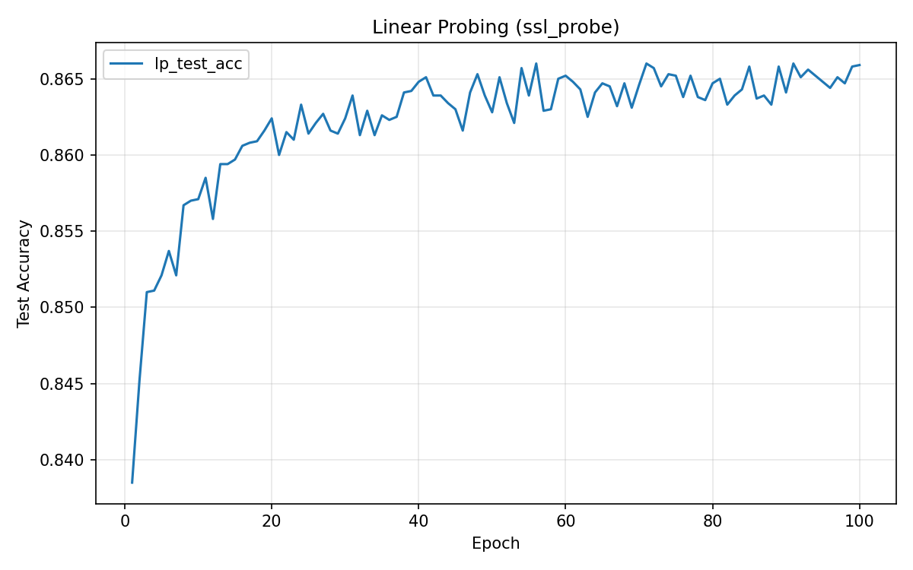
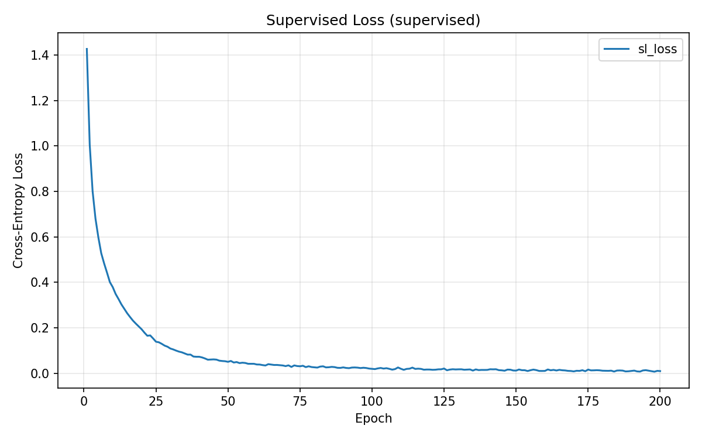
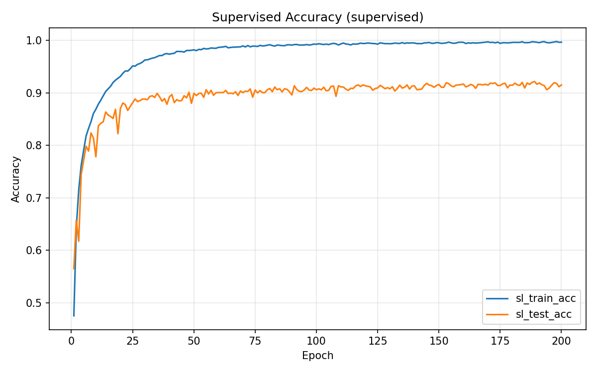

# AI HW2 — SimCLR 實驗報告（必做部分）

## 1. 實驗目標

在 CIFAR-10 資料集上，以修改過的 ResNet-18 為 backbone，實作並比較：

1. **SimCLR 自監督學習 (SSL)** — 使用對比學習訓練 backbone，再用 linear probing 評估表徵品質
2. **監督式學習 (SL)** — 傳統端到端監督訓練作為 baseline

核心問題：**不使用標籤的自監督學習，能學到多接近監督式學習的表徵？**

---

## 2. 實驗設定

### 模型架構

| 組件 | 規格 |
|------|------|
| Backbone | Modified ResNet-18（conv1 改為 3x3/stride=1, 移除 maxpool） |
| Projector Head | MLP: 512 → 512 → 128（僅 SimCLR 訓練時使用） |
| Classification Head | Linear: 512 → 10（監督式訓練 / Linear probing） |

### 超參數

| 參數 | SimCLR | Supervised | Linear Probing |
|------|--------|------------|----------------|
| Optimizer | Adam | Adam | Adam |
| Learning Rate | 3e-4 | 3e-4 | 1e-3 |
| Weight Decay | 1e-6 | 1e-6 | 1e-6 |
| Batch Size | 256 | 256 | 256 |
| Epochs | 200 | 200 | 100 |
| Temperature | 0.5 | — | — |

### SimCLR 資料增強

| Transform | 參數 | 機率 |
|-----------|------|------|
| RandomResizedCrop | size=32, scale=(0.2, 1.0) | 1.0 |
| RandomHorizontalFlip | — | 0.5 |
| ColorJitter | brightness=0.4, contrast=0.4, saturation=0.4, hue=0.1 | 0.8 |
| RandomGrayscale | — | 0.2 |
| Normalize | CIFAR-10 mean/std | 1.0 |

---

## 3. 實驗結果

### 3.1 SimCLR 自監督訓練

#### NT-Xent Loss 曲線

Loss 從初始的 **5.265** 持續下降至最終的 **4.502**，訓練過程穩定收斂。前 50 個 epoch 下降最為迅速（5.265 → 4.598），之後逐漸趨緩。

#### kNN Monitor 準確率曲線

kNN 準確率（k=20）的變化趨勢：

| Epoch | kNN Accuracy |
|-------|-------------|
| 1 | 44.31% |
| 10 | 63.33% |
| 25 | 71.84% |
| 50 | 76.33% |
| 100 | 81.16% |
| 150 | 83.15% |
| 175 | 84.18% |
| 200 | 84.55% |

kNN 準確率從隨機水準（~10%）快速攀升，在第一個 epoch 後就達到 44.31%，說明模型在訓練初期就已開始學到有意義的表徵。在 200 epochs 後達到 **84.55%**，但增速已明顯放緩，尚未完全飽和。

### 3.2 SSL 模型的 Linear Probing

凍結 SimCLR 訓練好的 backbone，僅訓練一層線性分類器：

| 指標 | 值 |
|------|------|
| 最終 Test Accuracy | **86.59%** |
| 最佳 Test Accuracy | **86.60%** |
| 最終 Loss | 0.300 |

Linear probing 準確率（86.59%）高於 kNN 準確率（84.55%），這是合理的，因為線性分類器經過 100 epochs 的訓練，能比固定的 kNN 更好地利用學到的表徵空間。

### 3.3 監督式學習 Baseline

| 指標 | 值 |
|------|------|
| 最終 Train Accuracy | 99.65% |
| 最終 Test Accuracy | **91.51%** |
| 最佳 Test Accuracy | **92.16%** (Epoch 189) |

監督式訓練在約 80 個 epoch 後 train accuracy 就超過 99%，但 test accuracy 在 ~91% 附近波動，顯示出一定程度的過擬合。

---

## 4. 比較與分析

### 4.1 三者準確率比較

| 方法 | Test Accuracy | 備註 |
|------|:---:|------|
| **Supervised Learning** | **91.51%** | 端到端訓練，使用全部標籤 |
| **SimCLR + Linear Probing** | **86.59%** | 不使用標籤訓練 backbone |
| SimCLR kNN Monitor | 84.55% | 無需額外訓練的評估 |

### 4.2 關鍵觀察

#### (1) SSL vs. SL 的差距約 5%

SimCLR linear probing（86.59%）與監督式學習（91.51%）相差約 **4.92 個百分點**。考慮到 SimCLR 在訓練 backbone 時**完全不使用任何標籤**，這個差距相當小，證明了自監督對比學習能有效擷取有意義的視覺表徵。

#### (2) Loss 曲線不直接反映表徵品質

SimCLR 的 NT-Xent loss 從 5.265 降到 4.502，降幅看似不大。但 kNN 準確率卻從 44% 躍升到 85%。這驗證了作業說明中的觀點：**SSL 的 loss 數值本身不是好的學習指標**，因為 loss 的數值取決於 batch size 和 temperature 等因素，而非直接對應分類能力。kNN monitor 才是追蹤表徵品質的有效方法。

#### (3) 監督式訓練的過擬合現象

監督式模型的 train accuracy 高達 99.65%，但 test accuracy 僅 91.51%，中間存在約 8% 的 generalization gap。相比之下，SimCLR 的 kNN 準確率直接在 test set 上評估，不存在這種 gap。這暗示 SSL 學到的表徵可能具有更好的泛化性，尤其在下游任務的資料量有限時。

#### (4) 學習速度的差異

| Milestone | SimCLR (kNN) | Supervised (Test Acc) |
|-----------|:---:|:---:|
| Epoch 10 | 63.33% | 77.82% |
| Epoch 50 | 76.33% | 89.90% |
| Epoch 100 | 81.16% | 90.59% |
| Epoch 200 | 84.55% | 91.51% |

監督式學習收斂更快（因為直接利用了標籤的監督信號），而 SimCLR 的收斂較慢但持續穩定提升。值得注意的是，監督式模型在 epoch 50 之後準確率提升非常有限（89.9% → 91.5%），而 SimCLR 在同期仍有明顯進步（76.3% → 84.6%），顯示 SSL 若訓練更長時間，差距可能進一步縮小。

### 4.3 Linear Probing 的意義

Linear probing 的本質是：如果一個凍結的 encoder 輸出的特徵，能讓一個簡單的線性分類器就達到高準確率，那代表 encoder 已經學到了線性可分的、高品質的表徵。86.59% 的 linear probing 結果說明 SimCLR backbone 的 512 維輸出空間中，不同類別的資料點已經被很好地分開了。

---

## 5. 結論

1. SimCLR 自監督學習在 CIFAR-10 上達到 **86.59%** 的 linear probing 準確率，與監督式學習的 **91.51%** 差距僅約 5%，證明了對比學習在不使用標籤的情況下學習有效視覺表徵的能力。
2. kNN monitor 是追蹤 SSL 訓練品質的有效工具，其趨勢與最終 linear probing 結果一致。
3. 監督式訓練雖然準確率較高，但存在明顯的過擬合現象；SSL 表徵在泛化性方面可能有其優勢，值得在 transfer learning 場景下進一步驗證。
