# AI HW2 — Ablation Study 與 Transfer Learning 報告

## 1. 實驗概述

本報告在 report1 的 baseline（temperature=0.5, 有 projector）基礎上，進行以下實驗：

1. **溫度參數 (Temperature) 消融** — 比較 temperature = 0.1 / 0.5 / 5.0 對訓練過程與最終效能的影響
2. **Projector Head 消融** — 移除 projector head，直接使用 backbone 的 512 維輸出計算 NT-Xent loss
3. **Random Baseline** — 隨機初始化 backbone 且不訓練，直接做 linear probing，作為下界參照
4. **Transfer Learning** — 凍結 backbone，在 CIFAR-100 上做 linear probing，比較 SSL / SL / Random 的泛化能力

所有 SimCLR 實驗使用相同的 backbone（Modified ResNet-18）、batch size（256）、optimizer（Adam, lr=3e-4）、訓練 200 epochs。

---

## 2. 溫度參數消融 (Temperature Ablation)

### 2.1 NT-Xent Loss 的溫度參數

溫度參數 $\tau$ 出現在 NT-Xent loss 的 softmax 計算中：

$$\ell_i = -\log \frac{\exp(\text{sim}(z_i, z_{i^+}) / \tau)}{\sum_{k \neq i} \exp(\text{sim}(z_i, z_k) / \tau)}$$

- **低溫 ($\tau$ = 0.1)**：放大相似度的差異，使 softmax 分佈更加尖銳（peaked），模型更關注最相似的負樣本
- **高溫 ($\tau$ = 5.0)**：壓縮相似度的差異，使 softmax 分佈更加均勻（uniform），模型平等對待所有負樣本

### 2.2 Loss 曲線比較

| | |
|:---:|:---:|
| 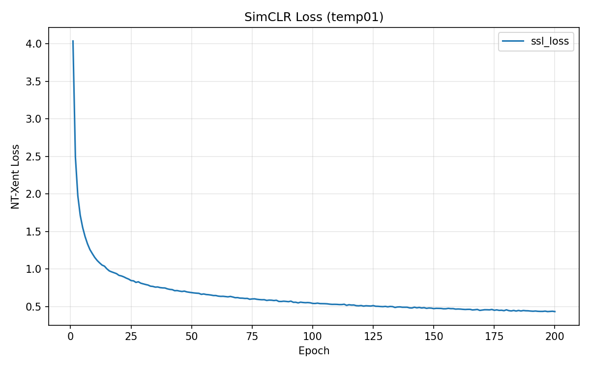 | 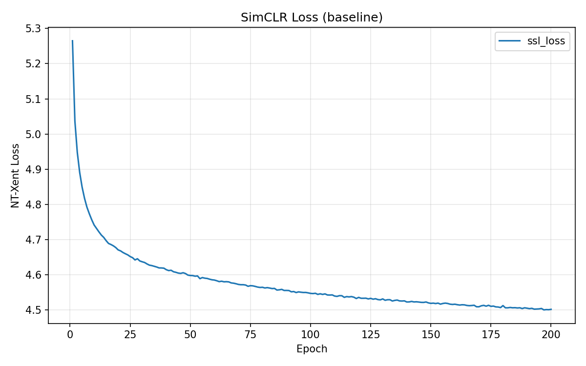 |
| **Temperature = 0.1** | **Temperature = 0.5 (Baseline)** |
| 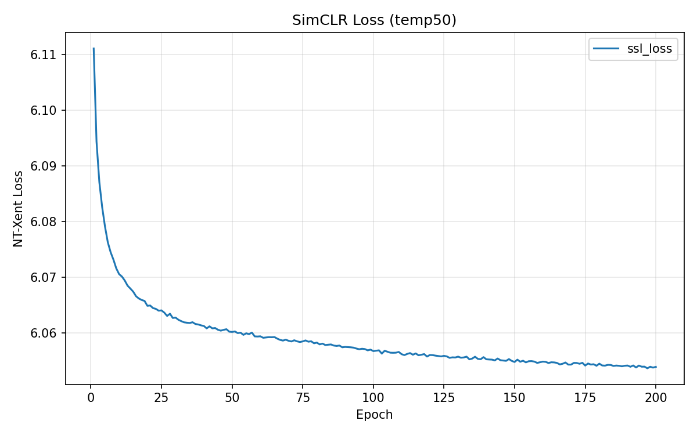 | |
| **Temperature = 5.0** | |

#### Loss 數值比較

| Temperature | 初始 Loss | 最終 Loss | Loss 下降量 |
|:-----------:|:---------:|:---------:|:-----------:|
| 0.1 | 4.036 | 0.433 | **3.603** |
| 0.5 (baseline) | 5.265 | 4.502 | 0.763 |
| 5.0 | 6.111 | 6.054 | **0.057** |

**關鍵觀察：Loss 的絕對數值不具可比性。** 不同的溫度直接改變了 loss 的 scale：
- $\tau$ = 0.1 時，相似度被放大 10 倍，softmax 輸出的機率值更極端，loss 可以降到很低
- $\tau$ = 5.0 時，相似度被壓縮到接近 0，所有機率接近均勻分佈 ($\frac{1}{2N-1}$)，loss 接近 $\log(2N-1) \approx 6.24$，幾乎不下降

因此 **loss 下降量的大小不代表學到的表徵更好**，必須搭配 kNN 準確率才能判斷。

### 2.3 kNN 準確率曲線比較

| | |
|:---:|:---:|
| 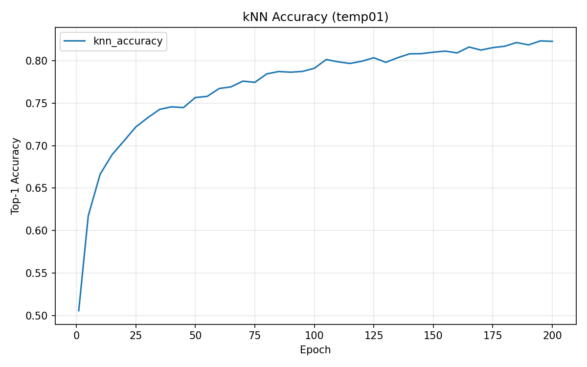 | 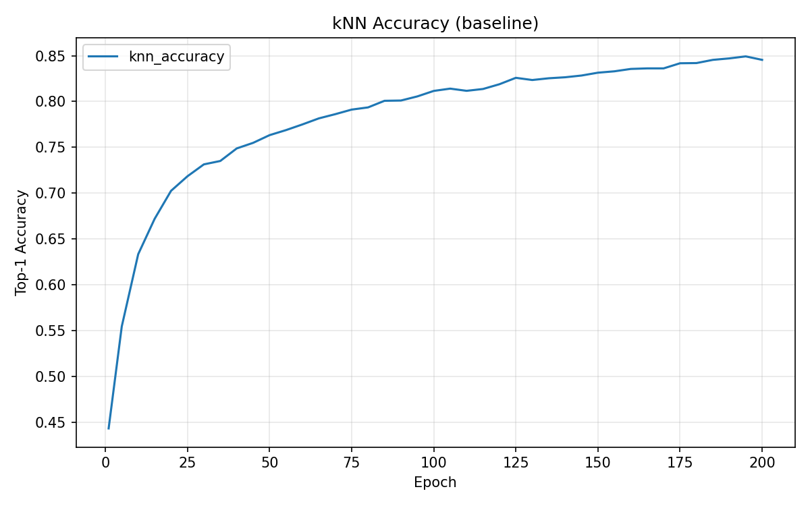 |
| **Temperature = 0.1** | **Temperature = 0.5 (Baseline)** |
| 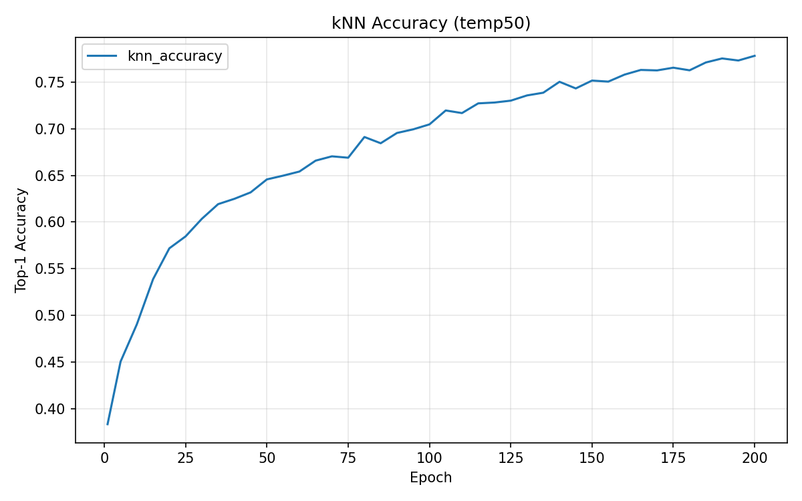 | |
| **Temperature = 5.0** | |

#### kNN 準確率隨 Epoch 變化

| Epoch | $\tau$ = 0.1 | $\tau$ = 0.5 (baseline) | $\tau$ = 5.0 |
|:-----:|:--------:|:--------:|:--------:|
| 1 | 50.59% | 44.31% | 38.36% |
| 10 | 66.64% | 63.33% | 49.05% |
| 50 | 75.65% | 76.33% | 64.57% |
| 100 | 79.09% | 81.16% | 70.46% |
| 150 | 80.98% | 83.15% | 75.15% |
| 200 | **82.26%** | **84.55%** | **77.80%** |

**觀察：**
- **$\tau$ = 0.5 (baseline) 效果最佳**，最終 kNN 達 84.55%
- **$\tau$ = 0.1 初期學習較快**（epoch 1: 50.59% vs 44.31%），但後期收斂較慢，最終落後 baseline 約 2.3%
- **$\tau$ = 5.0 全程表現最差**，學習速度慢且最終只達 77.80%，落後 baseline 約 6.8%

### 2.4 Linear Probing 結果

| Temperature | kNN Accuracy (Epoch 200) | Linear Probing Accuracy |
|:-----------:|:------------------------:|:-----------------------:|
| 0.1 | 82.26% | **84.43%** |
| 0.5 (baseline) | 84.55% | **86.60%** |
| 5.0 | 77.80% | **82.03%** |

Linear probing 的趨勢與 kNN 一致，baseline 的 $\tau$ = 0.5 仍然是最佳選擇。

### 2.5 溫度參數分析

#### Loss 與 kNN 的不一致性

這三個實驗清楚展示了 **loss 曲線與 kNN 曲線的不一致性**：

| Temperature | Loss 下降幅度 | kNN 最終表現 |
|:-----------:|:------------:|:----------:|
| 0.1 | 最大 (3.603) | 中等 (82.26%) |
| 0.5 | 中等 (0.763) | **最佳** (84.55%) |
| 5.0 | 最小 (0.057) | 最差 (77.80%) |

$\tau$ = 0.1 的 loss 下降幅度是 baseline 的 4.7 倍，但 kNN 表現反而更差。這再次證明：**SSL 中的 loss 數值不適合作為模型品質的指標。**

#### 為什麼 $\tau$ = 0.1 表現不佳？

低溫使 softmax 過於尖銳，模型只需要將正對（positive pair）的相似度略微高於最強的負樣本（hardest negative）就能大幅降低 loss。這導致：
1. 模型過度關注少數困難的負樣本，忽略了整體的表徵結構
2. 梯度主要來自 hardest negatives，訓練不穩定
3. 表徵空間的全局結構較差，不利於下游分類任務

#### 為什麼 $\tau$ = 5.0 表現不佳？

高溫使 softmax 過於平坦，所有負樣本的權重幾乎相等：
1. 模型收到的梯度信號非常微弱（因為所有機率接近 $\frac{1}{2N-1}$）
2. 學習效率極低，200 epochs 不足以充分學習
3. 模型無法有效區分困難負樣本和簡單負樣本

#### 最佳溫度的直觀理解

$\tau$ = 0.5 是一個平衡點：既不會過度關注 hardest negatives（$\tau$ 太小），也不會忽視樣本間的差異（$\tau$ 太大），使模型能有效學習整體的表徵結構。

---

## 3. Projector Head 消融

### 3.1 實驗設計

移除 projector head（設 `use_projector=False`），直接用 backbone 的 512 維輸出計算 NT-Xent loss，而非先投影到 128 維再算 loss。其餘設定與 baseline 完全相同。

### 3.2 Loss 與 kNN 曲線

| | |
|:---:|:---:|
| 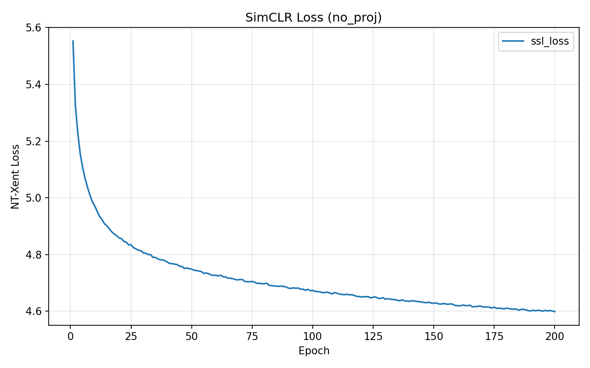 | 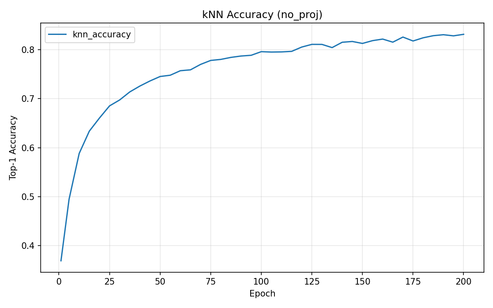 |
| **No Projector — Loss** | **No Projector — kNN** |

### 3.3 與 Baseline 的比較

#### kNN 準確率

| Epoch | Baseline (有 projector) | 無 Projector | 差距 |
|:-----:|:----------------------:|:----------:|:----:|
| 1 | 44.31% | 36.92% | -7.39% |
| 50 | 76.33% | 74.54% | -1.79% |
| 100 | 81.16% | 79.61% | -1.55% |
| 150 | 83.15% | 81.29% | -1.86% |
| 200 | **84.55%** | **83.15%** | **-1.40%** |

#### Linear Probing 準確率

| 模型 | kNN (Epoch 200) | Linear Probing |
|:----:|:---------------:|:--------------:|
| Baseline（有 projector） | 84.55% | **86.60%** |
| 無 Projector | 83.15% | **83.96%** |
| 差距 | -1.40% | **-2.64%** |

### 3.4 Projector Head 的作用分析

移除 projector 後 linear probing 下降了 **2.64%**（86.60% → 83.96%），這驗證了 SimCLR 原始論文中 projector head 的重要性。

#### 為什麼 Projector Head 能提升表徵品質？

Projector head 的核心價值在於**保護 backbone 的表徵空間不被 contrastive loss 破壞**：

1. **資訊瓶頸效應**：Projector 將 512 維壓縮到 128 維，這個壓縮過程迫使模型丟棄部分資訊。由於 loss 是在 128 維空間上計算的，被丟棄的資訊對 loss 無影響，但仍保留在 backbone 的 512 維輸出中。

2. **Loss 造成的表徵退化**：NT-Xent loss 傾向於讓表徵去除「對比任務無用但對下游任務有用」的資訊（例如顏色、紋理細節）。Projector 讓這種退化發生在投影空間而非 backbone 空間中。

3. **直觀比喻**：Projector 相當於一個「犧牲層」—— 它吸收了 contrastive loss 的負面影響，讓 backbone 能保留更通用的表徵。

#### 無 Projector 時發生了什麼？

沒有 projector 時，NT-Xent loss 直接作用在 backbone 的 512 維輸出上，backbone 被迫將表徵最佳化為「找到 mate」這個任務，而非學習通用的視覺特徵。因此：
- kNN 下降了 1.4%（backbone 空間的全局結構略差）
- Linear probing 下降了 2.6%（backbone 輸出的線性可分性明顯降低）
- Linear probing 的降幅大於 kNN，說明 projector 特別有助於提升表徵的線性可分性

---

## 4. 綜合比較

### 所有實驗結果總覽

| 實驗 | Temperature | Projector | kNN (Epoch 200) | Linear Probing |
|:----:|:-----------:|:---------:|:----------------:|:--------------:|
| Baseline | 0.5 | 有 | 84.55% | **86.60%** |
| 低溫 | 0.1 | 有 | 82.26% | 84.43% |
| 高溫 | 5.0 | 有 | 77.80% | 82.03% |
| 無 Projector | 0.5 | 無 | 83.15% | 83.96% |

### 影響程度排序

1. **溫度從 0.5 → 5.0**：Linear probing 下降 4.57%（影響最大）
2. **移除 Projector**：Linear probing 下降 2.64%
3. **溫度從 0.5 → 0.1**：Linear probing 下降 2.17%

---

## 5. Random Baseline（下界參照）

### 5.1 實驗設計

隨機初始化一個 Modified ResNet-18 backbone，**不做任何訓練**，直接凍結權重並在其上訓練線性分類器（linear probing）。這提供了一個理論下界：即使完全隨機的特徵投影，線性分類器仍可能學到一些結構。

### 5.2 CIFAR-10 結果

| 方法 | Linear Probing Accuracy |
|:----:|:-----------------------:|
| Random Backbone | **40.29%** |
| SimCLR (SSL) | 86.60% |
| Supervised | 91.51% |

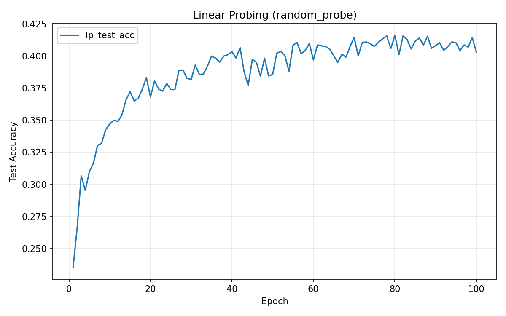

### 5.3 分析

Random baseline 的 40.29% 遠高於隨機猜測的 10%，這是因為：
- ResNet-18 的卷積架構本身就帶有一定的歸納偏置（inductive bias），即使權重隨機，卷積操作仍會提取某些基本的局部特徵（邊緣、紋理等）
- 線性分類器經過 100 epochs 的訓練，有能力從這些粗糙的特徵中找到一些模式

但與 SSL（86.60%）和 SL（91.51%）相比，差距分別為 **46.31%** 和 **51.22%**，這清楚量化了「訓練 backbone」所帶來的巨大價值。

| 比較 | Accuracy 差距 | 含義 |
|:----:|:---:|:---|
| SSL vs Random | +46.31% | 自監督訓練的價值 |
| SL vs Random | +51.22% | 監督式訓練的價值 |
| SSL vs SL | -4.91% | 不使用標籤的代價 |

**結論**：不使用標籤的 SSL 恢復了監督式學習約 **90%** 的表徵品質提升（46.31 / 51.22 ≈ 90.4%）。

---

## 6. Transfer Learning — CIFAR-100

### 6.1 實驗設計

Foundation model 的一個重要特性是表徵的**泛化能力**——在一個資料集上學到的特徵能否遷移到不同的資料集？

實驗方法：
- 凍結在 CIFAR-10 上訓練好的 backbone（SSL / Supervised / Random）
- 在 **CIFAR-100**（100 類，每類 500 張訓練圖片）上做 linear probing
- Linear probing 設定：Adam, lr=1e-3, 100 epochs，與 CIFAR-10 實驗完全相同
- CIFAR-100 圖片 resize 到 32×32 並使用 CIFAR-100 的 normalization

### 6.2 結果

| Backbone 來源 | CIFAR-10 Linear Probing | CIFAR-100 Linear Probing |
|:----:|:---:|:---:|
| **SimCLR (SSL)** | 86.60% | **50.50%** |
| **Supervised (SL)** | 91.51% | **49.48%** |
| **Random** | 40.29% | **19.16%** |

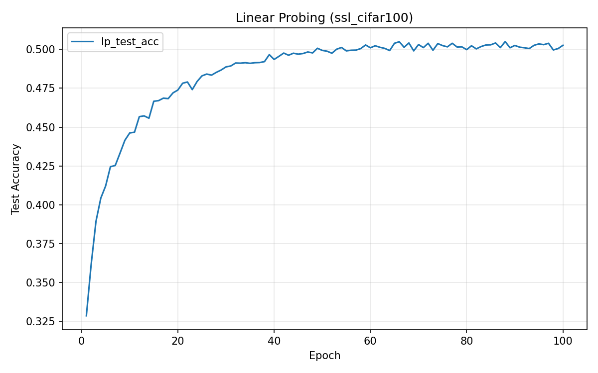

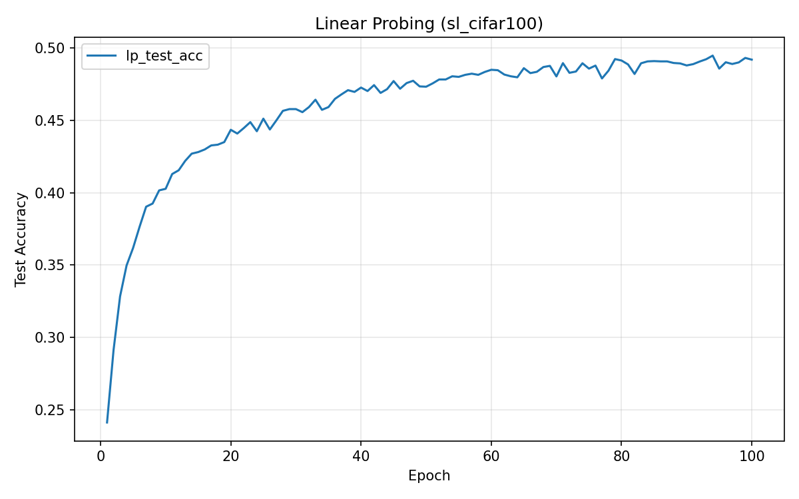

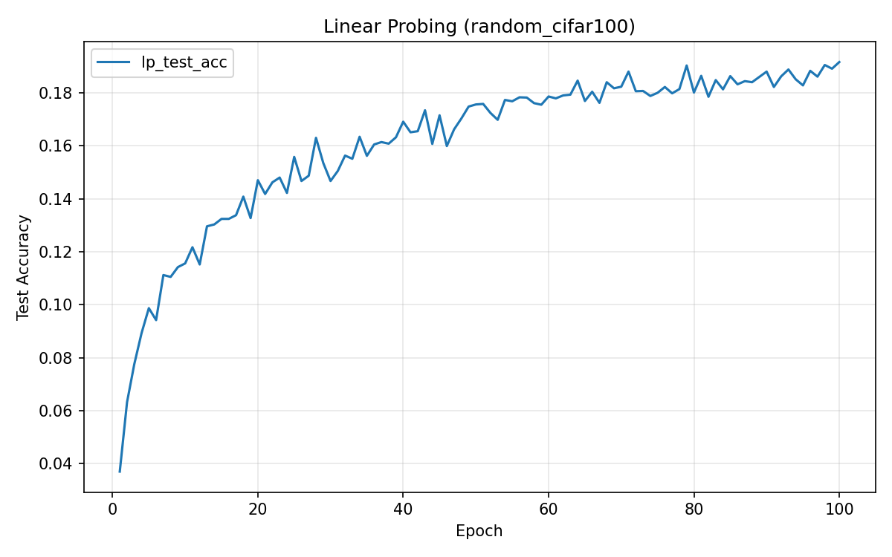

### 6.3 關鍵觀察

#### (1) SSL 在 transfer 上超越了 Supervised

在 CIFAR-10 上，Supervised（91.51%）大幅領先 SSL（86.60%），差距約 5%。但在 CIFAR-100 transfer 上，**SSL（50.50%）反而超越了 Supervised（49.48%）**，雖然差距僅 1%，但趨勢的逆轉非常有意義。

| 評估場景 | SSL | Supervised | 領先者 |
|:--------:|:---:|:----------:|:------:|
| CIFAR-10 (同分佈) | 86.60% | **91.51%** | SL +4.91% |
| CIFAR-100 (跨分佈) | **50.50%** | 49.48% | SSL +1.02% |

#### (2) 為什麼 SSL 的 transfer 能力更強？

這個結果揭示了 SSL 與 SL 學到的表徵的本質差異：

- **Supervised Learning** 的表徵被最佳化為區分 CIFAR-10 的 10 個特定類別。這些特徵與 CIFAR-10 的標籤空間高度綁定，遷移到不同的分類體系時表現下降。

- **SimCLR (SSL)** 的表徵被最佳化為區分任意兩張不同的圖片（instance discrimination）。這種目標不依賴任何特定的標籤體系，因此學到的特徵更加**通用**——它們捕捉的是視覺內容的本質差異，而非特定任務的決策邊界。

#### (3) Accuracy 下降幅度比較

| Backbone | CIFAR-10 → CIFAR-100 下降 | 下降比例 |
|:--------:|:---:|:---:|
| SSL | 86.60% → 50.50% | -41.7% |
| Supervised | 91.51% → 49.48% | -45.9% |
| Random | 40.29% → 19.16% | -52.4% |

SSL 的相對下降幅度（41.7%）小於 Supervised（45.9%），再次印證 SSL 表徵的泛化能力更強。

#### (4) 任務難度因素

CIFAR-100 的 100 類、每類僅 500 張訓練圖片，相比 CIFAR-10 的 10 類、每類 5000 張，分類難度大幅提升。所有模型的 accuracy 大幅下降是預期中的。50% 的準確率在 100 類問題中其實已是合理的表現（隨機猜測為 1%）。

---

## 7. 綜合比較

### 所有實驗結果總覽

| 實驗 | CIFAR-10 Linear Probing | CIFAR-100 Transfer |
|:----:|:-----------------------:|:------------------:|
| **SimCLR Baseline** ($\tau$=0.5, 有 projector) | **86.60%** | **50.50%** |
| SimCLR ($\tau$=0.1) | 84.43% | — |
| SimCLR ($\tau$=5.0) | 82.03% | — |
| SimCLR (無 projector) | 83.96% | — |
| **Supervised Learning** | **91.51%** | **49.48%** |
| **Random Baseline** | **40.29%** | **19.16%** |

### 影響因素排序（對 CIFAR-10 Linear Probing 的影響）

| 因素 | Accuracy 變化 |
|:----:|:---:|
| 訓練 vs 不訓練（SSL vs Random） | +46.31% |
| 使用標籤 vs 不使用（SL vs SSL） | +4.91% |
| 溫度 0.5 → 5.0 | -4.57% |
| 移除 Projector | -2.64% |
| 溫度 0.5 → 0.1 | -2.17% |

---

## 8. 結論

1. **溫度參數對 SimCLR 影響顯著**。$\tau$ = 0.5 是最佳選擇；過低的溫度（0.1）導致模型過度關注 hardest negatives，過高的溫度（5.0）使梯度信號過弱，兩者都損害表徵品質。
2. **Loss 曲線與表徵品質不一致**。$\tau$ = 0.1 的 loss 降幅最大但 kNN 並非最佳，$\tau$ = 5.0 的 loss 幾乎不動但 kNN 仍在穩步上升。這是因為不同溫度改變了 loss 的 scale，而非模型的學習效果。
3. **Projector head 是 SimCLR 的重要組件**。它通過資訊瓶頸效應，讓 backbone 保留更通用的表徵，避免被 contrastive loss 過度特化。移除後 linear probing 下降 2.64%。
4. **Random baseline 提供了有意義的下界**。SSL 恢復了監督式學習約 90% 的表徵品質提升，證明了不使用標籤的自監督學習的高效性。
5. **SSL 在 transfer learning 上展現更強的泛化能力**。在 CIFAR-100 上，SSL（50.50%）超越了 Supervised（49.48%），表明自監督學習的 instance discrimination 目標能學到更通用的視覺表徵，不受特定標籤體系的限制。這也是 foundation model 的核心價值所在。
